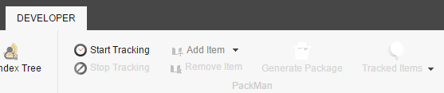
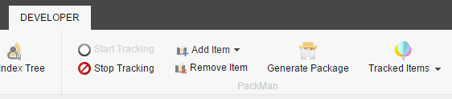
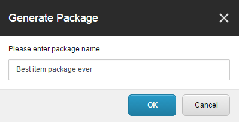
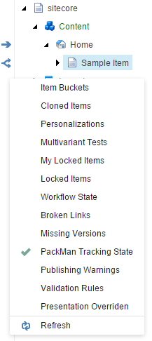

# Sitecore PackMan

The target audience of this module are Sitecore developers who want to keep track of Item and Template changes while working on new features. It enables you to automatically track those changes and add additional Items manually to the process. At the end of your work, you can generate a Item Package which contains all those changes without having to go into the Package Designer and remember which Items you touched. **All of this without leaving the Content Editor!**

On Youtube, you can see the module in action: https://www.youtube.com/v/abc

This module was created during the Sitecore Hackathon 2015 by Kevin Brechbühl ([@aquasonic](https://twitter.com/aquasonic)), Tobias Studer ([@studert](https://twitter.com/studert)) and Pascal Mathys ([@rootix](https://twitter.com/rootix)).

## Installation Instructions
You can either install the module with a Sitecore package over the `Installation Wizard` or compile the source code into your Sitecore installation.

### Package Installation
The module can be installed with the `Installation Wizard` in the Sitecore Desktop with the provided Sitecore package. For more information about package installations see [this blogpost](http://sitecoreguild.blogspot.ch/2013/03/quickstart-installing-sitecore-packages.html) (it's not written for Sitecore 8, but the process is the same). There are no additional post installation steps necessary, you can directly go and use the module.

### Compile Code
You can easily compile the complete code and deploy it to any Sitecore installation on your local environment. The following steps are necessary for a working deployment:

- Add a file `deploy.txt` into the `build` folder on the root directory of the source code. The file contains the path to your webroot, i.e. `D:\Sitecore8\Website`
- Add a new config file in the `App_Config\Include` folder with the following content (the path should point to the `serialization` folder of the source code:

		<configuration xmlns:patch="http://www.sitecore.net/xmlconfig/" xmlns:set="http://www.sitecore.net/xmlconfig/set/">
		  <sitecore>
		    <settings>
		      <setting name="SerializationFolder" set:value="D:\PackMan\serialization" />
		    </settings>
		  </sitecore>
		</configuration>

- Add `Sitecore.Kernel.dll` and `Sitecore.Client.dll` into the `lib` folder of the source code root. The assemblies must be copied from a Sitecore 8 installation.
- Open the solution and compile the code.
- Log into your Sitecore installation with an administrator.
- Go to `http://<your-sitecore-installation/unicorn.aspx` and click the button `Sync Default Configuration Now`. This should serialize all the needed items for the module.

You are now ready to use the module. If you make some changes to the code you can compile at any time. A post build event copies all needed files to your Sitecore installation. 

### Configuration
The module contains one config file called `Unic.PackMan.config` in the `App_Config\Include` folder. Mainly there are different pipeline where you could add additional processors if you need to. In the `<packman>` node it's also possible to configure include and exclude rules for the item tracking. Please read the instructions within the config file for further information.

### Compatibility
The module is compatible and tested with Sitecore 8 only.

## Usage

### Start Tracking
To start the tracking of the item changes, enable the Developer stripe in the Content Editor and click `Start Tracking`.

Every change on Items (which are allowed trough the configuration) will be tracked from now on. The tracking process ignores the Item languages and versions. If an Item changes, the whole item gets added to the Item package afterwards.

### Add Item(s) manually

If you want to add an Item or a whole tree manually to the Item package (In case you don't make any changes on them), you can select the appropriate Item in the Content Editor and choose `Add Item` or its child entry `Add Item with subitems`.

### Remove Item(s)

If you have added an Item by accident or want to discard an automatically added Item, select it in Content Editor and click on `Remove Item`. In case the Item was choosen to include the children, the whole child tree gets removed from the Item package tracking. You can't remove the child items from such a Item. In this case, you have to select the relevant Items one by one.

### Generate Package

If you have finished your work (and have at least one Item change), you can click on `Generate Package` to generate a package with all tracked Items in this Session. You have to choose a package name which will be part of the final package archive. If you have added many Items to the Session, it can take some time to generate the Item package for you.

After the package is generated, it is stored in the `($data)/packages` folder of your Sitecore solution and gets additionally downloaded by your Browser for you.

The package metadata will contain the following information:

- **Package Name**: Your entered package name
- **Author**: The Sitecore user which created the package
- **Version**: The UTC Time while generating the package

The name of the generated ZIP-file will look like <date>-<package name>.zip to have them sorted in case multiple developers generate packages.

### Show Tracked Items

As soon as there is at least one changed Item, the `Tracked Items` button will show you all tracked items in this Session.

#### Gutter Icons
Beside of the list of tracked Items, you can enable a so called Gutter to show directly in the content tree which Items are tracked. For doing this, you have to right click into the most left bar and choose `PackMan Tracking State` to enable them.

The two different Icons show you whether the children of the Item are included.

### Stop Tracking

If you have finished your tracking session, you can stop the tracking by clicking on `Stop Tracking`. You will be warned that all stored tracking information will be deleted if you do this. If you haven't generated the resulting Item package yet, do this first if you need the changes.

# Disclaimer

This module was built during a 24 hour hack session. We cannot guarantee that the output of the module is always 100% correct, so please check the results before rolling the packages out to production. It worked very well in our tests :)
